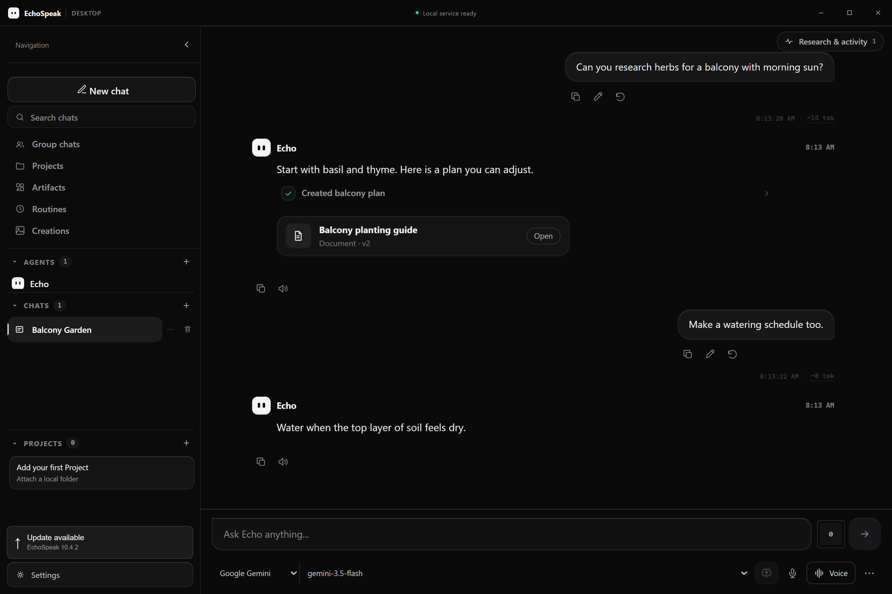

<h1 align="center">
  &nbsp; EchoSpeak
</h1>

<p align="center">
  <strong>A personal agent. A place to make things happen.</strong><br />
  Talk, research, build and create—with your choice of local or cloud models.
</p>

<p align="center">
  <a href="https://github.com/Ty0x7/EchoSpeak/releases/latest"></a>
  
  <a href="LICENSE"></a>
</p>

<p align="center">
  <a href="https://github.com/Ty0x7/EchoSpeak/releases/latest"><strong>Download for Windows</strong></a>
  &nbsp; · &nbsp;
  <a href="https://ty0x7.github.io/EchoSpeak/">Explore the website</a>
  &nbsp; · &nbsp;
  <a href="docs/GUIDE.md">Getting started</a>
</p>

---

EchoSpeak brings your conversations, projects, research and creations into one workspace. Echo can use tools to work on a request, keep the results, and help you continue later. Add Jarvis, Glados or your own agents when you want different perspectives or a team working together.

Run a compatible model on your computer, or connect **OpenAI, Google Gemini, Claude or Grok**. Choose the provider and model that fit your work; optional voice, generation and integrations can be set up when you need them.

<p align="center">
  
  <br />
  <sub>Current interface, shown with an example conversation and simulated provider responses. No private conversations or credentials are pictured.</sub>
</p>

## One workspace, more ways to work

| What you want to do | What EchoSpeak brings together |
| --- | --- |
| **Research a question** | Search, read webpages and PDFs, compare sources, and follow citations into the chat's Research panel. Keep passages, findings and open questions in a temporary notebook; export or explicitly save useful findings to a project. |
| **Build something** | Attach a project, work with its files, run commands using your configured terminal environment, and keep a project brief for later chats. Open saved apps, documents, code and diagrams as Artifacts. |
| **Create images and videos** | Ask in chat and keep the results in **Creations**. Use supported Gemini image, Google Veo video, MiniMax video or local ComfyUI generation. Edit supported images and keep their related versions. |
| **Talk with Echo** | Dictate a prompt, read a reply aloud, or enter a full voice conversation with the new Echo avatar and a fading live transcript. Compatible Gemini Live models use native audio; other chat models use your configured speech services. |
| **Bring a team** | Chat with Echo, Jarvis, Glados or custom agents. Use mentions and group chats for different perspectives, handoffs and shared work. Agents can have their own model and tools. |
| **Pick up where you left off** | Search earlier chats, keep saved personal memories and chat summaries, and switch chats or pages while active runs continue. Brief connection drops can reconnect to the existing run. |
| **Set things in motion** | Create scheduled routines and connect supported messaging services and tools. Configure optional integrations through Settings, including MCP connections. |

### See it in action

<details>
<summary><strong>Artifacts: keep the result beside the conversation</strong></summary>
<br />


Preview saved work, choose an earlier version, and use **Edit with Echo** to prepare a revision in chat. Artifacts, research and tool activity share the same right panel.

</details>

<details>
<summary><strong>Voice: Echo fills the conversation</strong></summary>
<br />


The sidebar stays available. Pause the microphone and speech, resume listening, or return to the text composer. Appearance settings are shared with the floating desktop companion.

</details>

*These interface previews use sample data. They demonstrate the UI, not a benchmark or a claim that a particular provider completed the example.*

## Your first few minutes

1. **Install.** Download the Windows setup EXE from the [latest published release](https://github.com/Ty0x7/EchoSpeak/releases/latest).
2. **Meet Echo.** First-launch setup helps you choose a model and check that it responds. Choose an installed local runtime or configure a cloud provider in Settings. Optional features can wait.
3. **Start your first chat.** Setup finishes before opening the conversation. Ask a question, attach a project or choose Voice.

For local chat, EchoSpeak supports **LM Studio, Ollama and compatible model servers**. Supported starter models can be downloaded and loaded through a running LM Studio or Ollama installation during setup. Local image/video generation has a separate optional setup and hardware requirements.

For cloud chat, Settings loads the provider's available model catalog and separately tests the selected model's response and tool round-trip. Use an API model ID available to your account; a consumer chat subscription does not automatically include API access.

## Try asking Echo

> **Research:** “Compare three approaches to growing herbs on a small balcony. Read several sources and explain what still needs checking.”
>
> **Build:** “In this attached project, make a small habit tracker. Show me the result and explain how to run it.”
>
> **Create:** “Create an image of a quiet, rainy street at night.”
>
> **Work together:** “@Jarvis research the options, then @Glados help build a prototype.”

These are starting prompts, not pre-recorded results. Available tools, model support and your settings determine what Echo can do.

## What's new in 10.5.0

The current source includes 10.5.0, alongside the 10.4.x installer, chat and voice improvements. The download button always points to the latest **published** release.

- **Tidier lists:** Group chats, Projects, Artifacts, Routines and Creations show three items with **Show more** / **Show less**.
- **Clearer model choice:** local and cloud providers grouped, each provider's saved model restored when you switch, and plain messages when a key or model is missing.
- **Settings where you'd look:** voice, channel, search and heartbeat options sit with their features, Advanced keeps only rarely changed options, and Settings search finds options by name.
- **From 10.4:** recoverable chats, research citations, image editing, message actions, full voice conversations with the new Echo avatar, and an Echo-branded installer.

[10.5.0 release notes](docs/releases/v10.5.0.md) · [10.4.3 release notes](docs/releases/v10.4.3.md) · [10.4.2 release notes](docs/releases/v10.4.2.md) · [10.4.0 reliability update](docs/releases/v10.4.0.md) · [10.x history](docs/releases/10.x-history.md)

## Your data and your choices

EchoSpeak stores chats, memories, project information and saved creations on your machine. **Local-first does not mean every feature is offline:** cloud models receive the conversation context they need, online search makes network requests, and cloud generation sends the approved prompt and any selected references to its provider.

Review tool permissions and approval requests before allowing changes or uploads. Docker can provide an isolated terminal environment when available; check the selected terminal mode before running commands. Download releases from this repository and keep the app updated. If Windows reports a threat, stop and report the warning through GitHub issues. Keep Windows protection enabled.

Never paste API keys into an issue, chat screenshot or public document. Configure them in Settings. Provider access, API billing and local GPU compatibility depend on the services and hardware you choose.

## Learn more

| Resource | Where to go |
| --- | --- |
| Install, models, voice and everyday use | [User guide](docs/GUIDE.md) |
| How the existing systems fit together | [Architecture](docs/ARCHITECTURE.md) |
| Planned work and remaining validation | [Roadmap](docs/ROADMAP.md) |
| Version-by-version changes | [Release notes](docs/releases/) and [Changelog](CHANGES.md) |
| Report a problem or suggest a feature | [GitHub issues](https://github.com/Ty0x7/EchoSpeak/issues) |

<details>
<summary><strong>For developers: run from source</strong></summary>

Use Python 3.11 or 3.12 and Node.js 22 or newer. Start the backend and frontend in separate terminals. For platform-specific instructions and optional dependencies, see the [guide](docs/GUIDE.md).

```bash
# Backend
cd apps/backend
python -m venv .venv
# Activate .venv using your shell's activation command.
python -m pip install -r requirements.txt
python app.py --mode api
```

```bash
# Frontend (a separate terminal, from the repository root)
cd apps/web
npm ci
npm run dev
```

The Windows desktop host lives in `apps/desktop`; the browser app lives in `apps/web` and the Python backend in `apps/backend`. Changes should extend these existing systems. Keep credentials, personal data and build artifacts out of commits.

</details>

---

<p align="center">
  <br />
  <strong>Bring Echo home.</strong><br />
  <a href="https://github.com/Ty0x7/EchoSpeak/releases/latest">Download EchoSpeak</a> ·
  <a href="https://ty0x7.github.io/EchoSpeak/">Website</a> ·
  <a href="LICENSE">MIT license</a>
</p>
