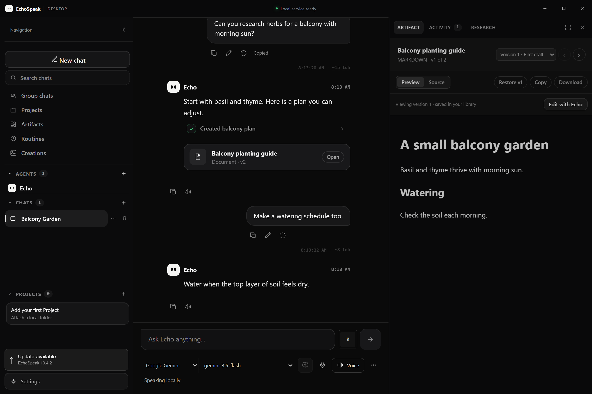
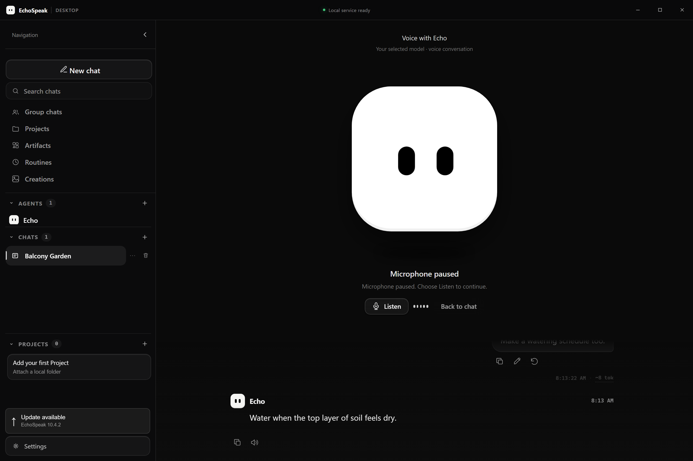

  

EchoSpeak connects a language model to the context, tools and execution controls needed to work on real tasks. Research a question, build in a project, create media or talk with Echo, while keeping the conversation and its results together.

Use **LM Studio, Ollama or a compatible local model server**, or connect **OpenAI, Google Gemini, Anthropic Claude or xAI Grok**. EchoSpeak manages the workspace and agent workflow; the selected model supplies reasoning and responses.

## The harness behind Echo

An agent needs more than a model connection. EchoSpeak provides the surrounding system that prepares each request, runs permitted tools, returns their results to the model and preserves the work.

1. **Context.** Your message, agent instructions, relevant conversation history and attached project information prepare the turn.
2. **Execution.** The model can respond directly or request tools. EchoSpeak checks permissions, project scope and approval requirements before an action runs.
3. **Iteration.** Tool results feed the next step, allowing Echo to inspect files, refine a search or revise its work within a bounded execution loop.
4. **Evidence.** Tool activity and saved outputs record what actually happened. Completion claims can be assessed against those records.
5. **Continuity.** Chats, project context, artifacts and research stay available for later work. Active runs continue when you switch pages, and brief connection drops can reconnect to the existing backend run.

The harness combines a **React workspace, Python backend and Rust desktop host**. Its lean agent runtime connects supported models to the same tool and permission system. Model compatibility determines which capabilities are available; permission decisions remain enforced in code.

## Capabilities

<table>
  <thead>
    <tr><th>Area</th><th>What you can do</th></tr>
  </thead>
  <tbody>
    <tr><td><strong>Research</strong></td><td>Search the web, read pages and PDFs, inspect citation evidence, and collect passages, findings and open questions in a temporary chat notebook. Export findings or explicitly save them to a project.</td></tr>
    <tr><td><strong>Projects and coding</strong></td><td>Work with attached project files and instructions, run commands in the configured terminal environment, and maintain a project brief across conversations.</td></tr>
    <tr><td><strong>Artifacts</strong></td><td>Save and preview supported apps, documents, code and diagrams. Review versions and prepare revisions with Edit with Echo. Research, artifacts and tool activity share one right panel.</td></tr>
    <tr><td><strong>Creations</strong></td><td>Generate images and videos through supported Gemini image, Google Veo video, MiniMax video or local ComfyUI integrations. Keep outputs in a media library, with editing and related versions for supported images.</td></tr>
    <tr><td><strong>Voice</strong></td><td>Dictate messages, listen to replies or enter a full voice conversation with Echo. Compatible Gemini Live models use native audio; other chat models use the configured speech services.</td></tr>
    <tr><td><strong>Agents and groups</strong></td><td>Use Echo, Jarvis, Glados or custom agents with their own instructions, models and tools. Coordinate through mentions, group conversations and shared tasks.</td></tr>
    <tr><td><strong>Memory and automation</strong></td><td>Search earlier chats, retain personal memories, use conversation summaries, schedule routines and connect supported messaging services or MCP tools.</td></tr>
  </tbody>
</table>

Active work requires the backend to remain running. Restarting it interrupts chat runs; saved output remains available, and interrupted tool actions are not automatically repeated. Scheduled routines also require a running backend.

## Interface previews

<strong>Artifacts and the shared right panel</strong>

 

Keep saved work beside the conversation. Preview an artifact, restore a version or prepare a revision without leaving the workspace.

<strong>Voice conversations</strong>

 

Echo fills the conversation area while navigation stays available. Microphone and speech controls let you pause, resume or return to text. Avatar settings are shared with the desktop companion.

Previews use sample conversations and simulated provider responses.

## Getting started

1. **Install EchoSpeak** from the [latest published release](https://github.com/Ty0x7/EchoSpeak/releases/latest).
2. **Complete setup.** Choose a local or cloud model and verify a response. Configure optional features when you need them.
3. **Start a conversation.** Ask a question, attach a project or choose Voice. Your first chat opens after setup is complete.

Local setup supports downloading and loading selected starter models through an existing, running LM Studio or Ollama installation. Local media generation has a separate optional setup with hardware requirements.

Cloud settings retrieve the provider's model catalog and separately check the selected model's response and tool exchange. Use a model ID available to your API account. Consumer subscriptions and API access are separate; chat checks do not validate every media or voice feature.

### Example requests

> **Research:** “Compare three approaches to growing herbs on a small balcony. Read several sources and explain what still needs checking.”
>
> **Build:** “In this attached project, make a small habit tracker. Show me the result and explain how to run it.”
>
> **Create:** “Create an image of a quiet, rainy street at night.”
>
> **Collaborate:** “@Jarvis research the options, then @Glados help build a prototype.”

## Current development

The source version is **11.1.1**, a fix for starting after an update plus clearer light-theme text. 11.1.0 added a light theme (now the default) with the classic dark theme a click away, and setup in its own window. 11.0.0 added learning from verified experience, described in the development preview below; whether it improves results is still being measured. 10.5.0 improved provider selection, settings organization and expandable lists. Earlier releases added recoverable chat streams, research citations, image editing, message actions, full voice conversations and an installer with Echo branding.

The release badge follows the latest **published installer**, which may differ from source development.

[11.1.1 notes](docs/releases/v11.1.1.md) · [11.1.0 notes](docs/releases/v11.1.0.md) · [Release history](docs/releases/) · [Changelog](CHANGES.md)

<strong>Development preview: learning from verified experience</strong>

An experimental development branch adds experience records and advisory lessons to the existing harness. This work is still undergoing validation and is not presented as a feature of the latest published installer.

The layer records what each agent did and distinguishes claims, successful execution, subsequent checks, corroborating evidence and owner confirmation. **Worked** and **Didn't work** feedback helps assess outcomes. A Learning page provides track records, lesson review and change history.

Relevant lessons can inform later tasks. Checked outcomes determine promotion or retirement, and agent track records inform routing and delegation. Lessons remain advisory: they do not retrain model weights, modify approval rules or grant tool access. Lessons derived from outside content or work that changed its own checks require owner review.

Reflection runs while chats are quiet, within a daily limit, using the agent's selected model. Cloud reflection can send task context to that provider and incur API charges. Learning can be paused per agent. Its records are separate from personal memory, and performance improvements have not yet been established through completed evaluation.

## Data and control

Chats, personal memory, project information and saved creations are stored on your machine. Cloud models receive the context needed for requests; search and cloud generation also use network services. API access, billing and local GPU compatibility depend on your chosen services and hardware.

Personal memory, temporary research notes, saved project findings and experimental learning lessons have distinct roles. Web research is not automatically stored as permanent personal memory. You choose when findings become project context.

Configure credentials in Settings and review approval requests before permitting changes or uploads. Docker can isolate terminal work when available; confirm the selected terminal mode before running commands. Never include API keys in public issues, documents or screenshots.

Download from this repository. If Windows reports a threat, stop and report the warning through [GitHub issues](https://github.com/Ty0x7/EchoSpeak/issues). Keep Windows protection enabled.

## Documentation

  <a href="docs/GUIDE.md"><strong>User guide</strong></a> · Installation and everyday use 
  <a href="docs/ARCHITECTURE.md"><strong>Architecture</strong></a> · System design at the document's stated baseline 
  <a href="docs/ROADMAP.md"><strong>Roadmap</strong></a> · Planned work and validation 
  <a href="docs/releases/"><strong>Release notes</strong></a> · Changes across versions 
  <a href="https://github.com/Ty0x7/EchoSpeak/issues"><strong>Issues</strong></a> · Bug reports and suggestions

<strong>Development structure</strong>

The desktop host lives in `apps/desktop`, the React frontend in `apps/web`, and the Python backend in `apps/backend`. The agent harness runs through `apps/backend/agent/lean`; the experimental experience layer lives in `apps/backend/agent/learning` on its development branch.

Source development uses Python 3.11 or 3.12 and Node.js 22 or newer. See the [guide](docs/GUIDE.md) for setup and optional dependencies. Extend the existing systems and keep credentials, personal data and build artifacts out of commits.

  <strong>A desktop agent harness for research, coding and creation.</strong> 
  Your choice of model. One workspace for context, tools and results.

  

