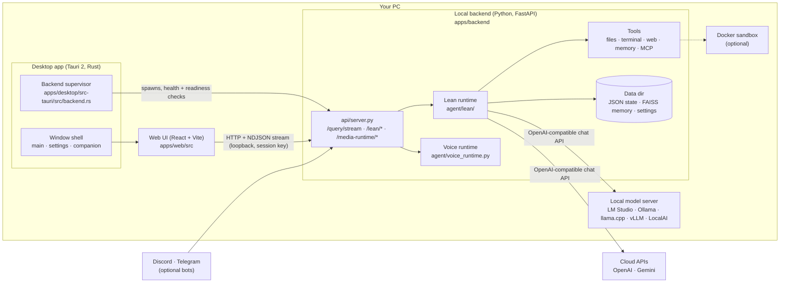
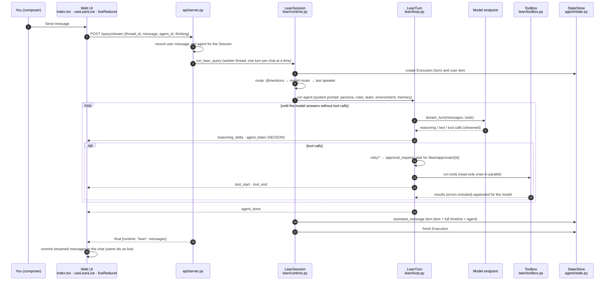
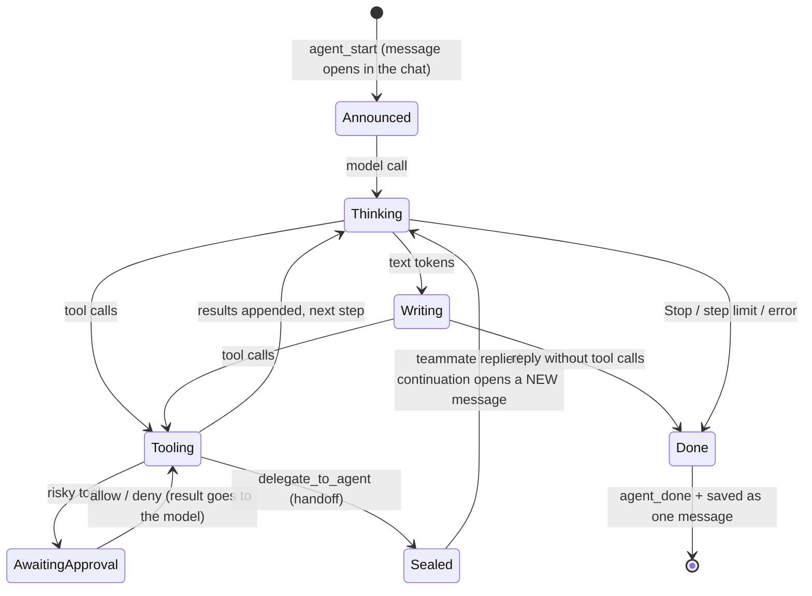
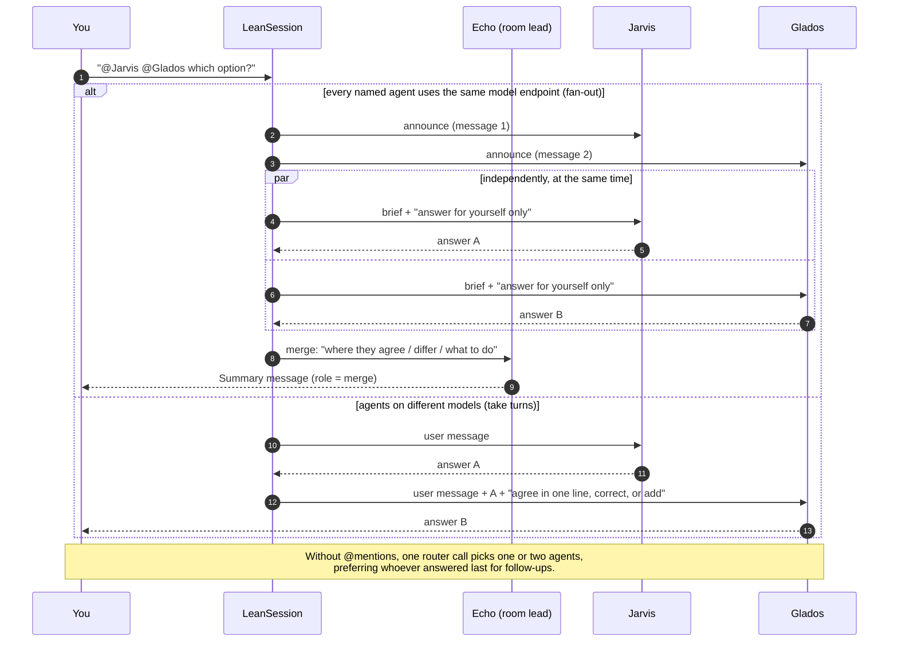
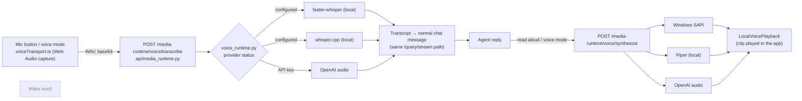

# EchoSpeak architecture

How EchoSpeak works as of 2026-10-02 (branch `echospeak-8.0`). This file is the
source of truth for the website's "How it works" diagram and copy
(`apps/web/src/marketing.tsx`). Older design documents in `docs/` and the root
`ARCHITECTURE.md` describe earlier runtimes and are kept for history.

## 1. System overview

- **Desktop shell.** `apps/desktop/src-tauri` is a Tauri 2 app with three windows: main, settings and companion. On launch, `backend.rs` reserves a free loopback port and generates a per-launch session key. It then starts the bundled backend (`backend-dist/echospeak-backend.exe`, a one-folder PyInstaller build) with `CREATE_NO_WINDOW`. It polls `/health`, then `/startup/readiness`, and only then shows the window. The backend is given the app's process id and exits when the app does.
- **Web UI.** `apps/web` is a single React app. In the desktop window it runs as `DesktopApp`; in a browser it runs at `/app` (the website lives at `/`). Both use the same `Dashboard` (`apps/web/src/index.tsx`) and the lean chat components in `apps/web/src/lean/`.
- **Backend.** `apps/desktop/backend/echospeak_backend.py` is the packaged entry and `apps/backend/app.py --mode api` is the dev entry. Both serve `api/server.py`. The lean runtime is the default (`ECHOSPEAK_LEAN_RUNTIME=0` falls back to the legacy runtime in `agent/core.py`).
- **Models.** Every agent turn calls an OpenAI-compatible `/chat/completions` endpoint (`agent/lean/provider.py`). That's a local server or a cloud API, and each persona can name its own provider and model.

## 2. One message, from input to streamed reply

Details that matter:

- **Events.** Each NDJSON line is one event:
  - Run level: `run_start`, `routing`, `delegation`.
  - Per agent message (every one carries `message_id` and `agent_id`): `agent_start`, `step_start`, `reasoning_delta`, `agent_token`, `text_replace`, `tool_start`, `tool_end`, `approval_request`, `approval_resolved`, `memory_saved`, `token_usage`, `agent_done`.
  - The UI batches events per animation frame (`useLeanLive.ts`) and reduces them by `message_id` (`liveReducer.ts`).
- **The loop never gives up on its own.**
  - Errors, bad tool arguments, denied approvals and repeated identical calls all go back to the model as tool results.
  - The loop ends when the model replies without calling a tool, when the user presses Stop (`POST /query/cancel`), or when it reaches `lean_max_iterations` (default 60). At that limit it asks the model for a final answer with no tools.
- **Context.** `_fit_context` shrinks old tool results and drops the oldest messages when a request would pass about 80% of the context window. Nothing is summarized yet (see section 7).
- **Approvals** (`lean/approvals.py`) are needed only for these:
  - Deleting files.
  - Dangerous terminal commands, matched by pattern.
  - Messages that leave the machine.
  - Desktop control.
  - Destructive or MCP actions.
  - Sources without a UI (routines, Discord) never wait for approval; the tool is refused instead.

## 3. Agent lifecycle

- **Personas** (`lean/personas.py`): Echo (personal agent, all toolsets), Jarvis (research and memory) and Glados (core, terminal, research and memory) are built in. Their ids are still `scout` and `forge` (they were renamed in store format 2, so old chats, rooms and `@scout` mentions keep working). Custom agents are saved in `lean/agents.json`, each with its own instructions ("soul"), toolsets and optional provider and model.
- **Toolsets** (`lean/toolbox.py`) pick which registered tools an agent sees. Some tools are native to the lean runtime:
  - `memory_save` and `memory_search`.
  - `delegate_to_agent`.
  - The coding tools in `lean/coding.py`.
  - The terminal in `lean/terminal.py`: host PowerShell or the persistent `echospeak-sandbox` Docker container.
- **Handoffs.**
  - `delegate_to_agent` closes the caller's message first. The teammate then runs with a fresh context: the brief plus your original message.
  - The caller's follow-up opens a new message below the teammate's reply. A follow-up with nothing to add is dropped.
  - Limits: nesting depth 2, at most 6 handoffs per user message, and no handing a task straight back to whoever delegated it.

## 4. Group-chat orchestration

- **Who answers** (`LeanSession._route`):
  - `@Name` mentions (up to 4).
  - `@all`, `@everyone` or `@team` picks every member.
  - Otherwise a short model call sees the roster, the last four messages and the last speaker. If that call fails, the last speaker answers.
- **Fan-out** (`_should_fan_out`, `_run_fan_out`) needs two or more agents named explicitly, and all of them on the same `(base_url, model)`. That way a local server never has to load two models at once. Messages open in the order named and are saved in that order, whichever finishes first. Settings: `lean_group_fan_out` and `lean_group_merge`, both on.
- **Rooms** (`lean/rooms.py`) are ordinary Sessions with an agent list (`lean/rooms.json`), so history, reload and memory work the same as in a one-to-one chat.

## 5. Voice and wake

- Speech-to-text runs on the backend. If no local Whisper model is configured and there's no API key, transcription is reported as unavailable instead of falling back silently.
- "Voice" mode loops: listen, send, speak the reply, listen again. "Read" reads replies aloud without the mic.
- **Wake word is not implemented.** `io_module/wake_listener.py` is a placeholder that raises a clear error, and the UI shows "Wake · Soon". PersonaPlex (full-duplex) is listed in settings as a disabled option.

## 6. Data and persistence

| What | Where | Format |
| --- | --- | --- |
| Data dir | Desktop: `%LOCALAPPDATA%\ai.echospeak.desktop\runtime`. Dev: `apps/backend/data`. Override: `ECHOSPEAK_DATA_DIR` | folder |
| Settings | `settings.json` (secrets in `settings.secrets.json`) | JSON |
| Sessions (chats) | `threads.json` | JSON |
| Turns, messages, tool runs, approvals | `phase3/executions.json`, `items.json`, `tool_runs.json`, `approvals.json`, `thread_state.json`, `events.json`, `traces/` (`agent/state.py`) | JSON, whole-file atomic writes |
| Agent messages | `assistant_message` items: `text`, `agent_id`, `message_id`, the full `timeline` (thinking, tools, approvals), `delegated_by`, `role` | inside `items.json` |
| Custom agents, group chats | `lean/agents.json`, `lean/rooms.json` | JSON |
| Memory | `memory/` (FAISS vector index + items), `memory_files/` (`agent/memory.py`) | FAISS + JSON |
| Routines | `routines/` (`agent/routines.py`) | JSON |
| Projects | Desktop: `<data dir>/projects/*.json`. Browser/dev: `apps/backend/projects/*.json` | JSON per project |
| Logs | Desktop: app log dir, `backend.log` (rotates at 10 MB, keeps 5) | text |
| UI preferences | Browser `localStorage` (sidebar split, toolbar state …) | per device |

Reloading a chat calls the Session timeline (`StateStore.session_timeline`). Each saved agent message is rebuilt from its timeline (`messageFromTimeline`), so a reloaded chat shows the same messages, order, thinking and tool rows as the live run.

## 7. Key directories

| Path | Owns |
| --- | --- |
| `apps/desktop/src-tauri/src/` | Window shell (`lib.rs`), backend supervisor (`backend.rs`), window state, single instance |
| `apps/desktop/backend/` | Packaged backend entry, PyInstaller spec, `--self-check` |
| `apps/desktop/scripts/` | `build-sidecar.ps1` (backend bundle + self-check), `build-windows.ps1` (full installer) |
| `apps/backend/api/` | FastAPI app (`server.py`), lean routes (`lean_routes.py`), voice/media routes (`media_runtime.py`) |
| `apps/backend/agent/lean/` | **The agent runtime:** loop, session/routing/fan-out, provider client, toolbox, approvals, prompt, personas, rooms, coding tools, terminal, automations, settings |
| `apps/backend/agent/state.py` | Durable turns, items, tool runs; Session timeline projection |
| `apps/backend/agent/tools.py`, `tool_registry.py` | Registered tools (web search, files, desktop, integrations) used by toolsets |
| `apps/backend/agent/memory.py` | Long-term memory (FAISS) |
| `apps/backend/agent/voice_runtime.py` | Voice provider detection and selection |
| `apps/backend/agent/core.py` + `semantic_runtime.py`, `turn_understanding.py`, `model_control_plane.py`, `task_runs.py` | **Legacy runtime.** Still hosts `EchoSpeakAgent.process_query` (the entry Discord and Telegram use, which forwards to the lean runtime) and the fallback when the lean runtime is off |
| `apps/web/src/index.tsx` | Dashboard: chat, composer, history load, streaming glue |
| `apps/web/src/lean/` | Agent messages, live reducer, status pill, mention menu, roster, dialogs, styles |
| `apps/web/src/components/` | Sidebar (`ProjectSidebar.tsx` + `sidebarSections.ts`), Echo face, avatar |
| `apps/web/src/settings/` | Settings app |
| `apps/web/src/marketing.tsx` | Website |
| `docs/research/`, `docs/audit/` | Research reports and the cleanup report |

## 8. What to work on next

In priority order. This is an honest view of the weak spots and debt.

1. **Retire the legacy runtime.** `agent/core.py` is 19.7k lines and still sits on the Discord and Telegram path (`process_query` forwards to the lean runtime) and owns the fallback. It's most of the 42 failing backend tests and most of the backend's size. The 1.1 GB backend bundle is mostly `torch`/`transformers` pulled in by legacy code paths. Move the channel entry points to `run_lean_text`, delete the legacy modules, then audit dependencies. **L, very high impact.**
2. **Replace the JSON state store with SQLite.** Every turn rewrites whole files (`executions.json` is already 2 MB on an active install), which gets slower as history grows and is fragile if the process is killed mid-write. SQLite also gives full-text session search for free (Hermes uses FTS5). **M–L, high.**
3. **Summarize instead of trimming context.** Long coding chats silently lose their earliest decisions on a 64k local model. Add a summary step and a visible "summarized above" marker (`docs/research/harness-review.md`, U1). **M, high.**
4. **An evaluation set.** Twenty real prompts (chat, coding, group chat, handoff), each checked for finishing, tool use and message order, run against Gemma 4 E4B after every harness change. Live checks this round caught a real bug that unit tests missed (agents answering for each other). **M, high.**
5. **Honest stop at the step limit.** Report "ran out of steps" and offer Continue, instead of forcing a final answer (harness review U2). **S, medium.**
6. **Split `apps/web/src/index.tsx`** (12.5k lines) into chat, composer, history and sidebar modules once the legacy activity UI can go (after item 1). **M–L, medium.**
7. **Voice onboarding, then wake word.** Voice only works after a Whisper model is set up by hand. A guided download in Settings would make the mic work out of the box. Wake word is the most requested missing feature. **M then L.**
8. **One projects folder.** Browser/dev mode reads `apps/backend/projects/` while desktop mode reads `<data dir>/projects/`. Found while making the website screenshot: an isolated data dir still showed real projects. **S, low but surprising.**
9. **A group "discussion" mode.** Several rounds with termination conditions (max messages, a `DONE` mention, Stop), reusing the router as the speaker selector (`docs/research/multi-agent-review.md`, P1). **L, medium.**
10. **Sandboxed terminal by default when Docker is running.** Commands run in the container with only the project mounted, and approvals are needed only for host or network access (harness review A1). **L, high once Docker is common.**
