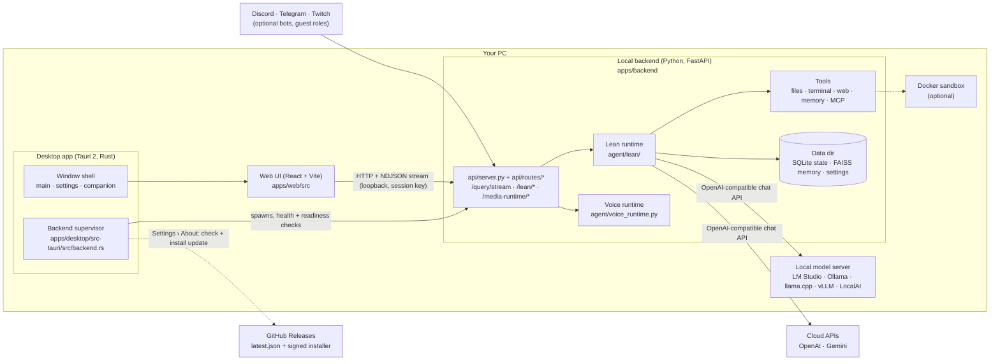
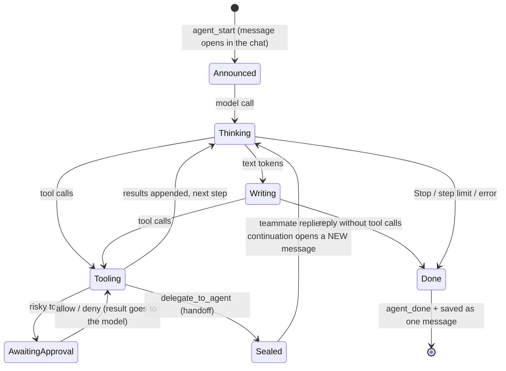
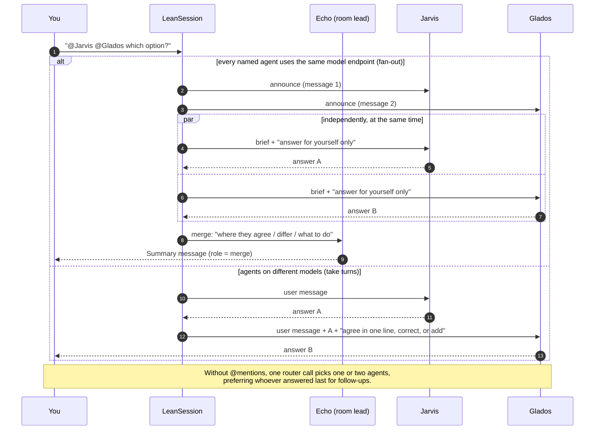
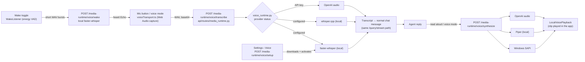

# EchoSpeak architecture

How EchoSpeak works today (10.2). For setup and day-to-day use see [GUIDE.md](GUIDE.md);
for what's next see [ROADMAP.md](ROADMAP.md). Older design documents are in
[archive/](archive/) and describe runtimes that no longer exist.

## 1. System overview



- **Desktop shell.** `apps/desktop/src-tauri` is a Tauri 2 app with three windows: main, settings and companion. On launch, `backend.rs` reserves a free loopback port and generates a per-launch session key. It then starts the bundled backend (`backend-dist/echospeak-backend.exe`, a one-folder PyInstaller build) with `CREATE_NO_WINDOW`. It polls `/health`, then `/startup/readiness`, and only then shows the window. The backend is given the app's process id and exits when the app does.
- **Web UI.** `apps/web` is a single React app. In the desktop window it runs as `DesktopApp`; in a browser it runs at `/app` (the website lives at `/`). Both use the same `Dashboard` (`apps/web/src/index.tsx`) and the lean chat components in `apps/web/src/lean/`.
- **Backend.** `apps/desktop/backend/echospeak_backend.py` is the packaged entry and `apps/backend/app.py --mode api` is the dev entry. Both serve `api/server.py`, which holds the app, lifespan and middleware and includes one router per area from `api/routes/`. The lean runtime is the only runtime: every source (app, voice, Discord, Telegram, routines) goes through `EchoSpeakAgent.process_query` → `run_lean_query`. `agent/core.py` (~1k lines) is the app object: model client, memory, soul, skill workspace, Project scope and the doctor report.
- **Updates.** `src-tauri/src/updates.rs` reads `latest.json` from the newest GitHub release (`tauri-plugin-updater`), verifies the installer's signature against the public key in `tauri.conf.json`, stops the backend, and runs the installer, which restarts the app. `apps/desktop/scripts/release-windows.ps1` produces the signed installer and `latest.json`.
- **Models.** Every agent turn calls an OpenAI-compatible `/chat/completions` endpoint (`agent/lean/provider.py`). That's a local server or a cloud API, and each persona can name its own provider and model.

## 2. One message, from input to streamed reply


Details that matter:

- **Events.** Each NDJSON line is one event:
  - Run level: `run_start`, `routing`, `delegation`.
  - Per agent message (every one carries `message_id` and `agent_id`): `agent_start`, `step_start`, `reasoning_delta`, `agent_token`, `text_replace`, `tool_start`, `tool_end`, `approval_request`, `approval_resolved`, `memory_saved`, `token_usage`, `agent_done`.
  - Job level: `job_continue`, `run_outcome`.
  - The UI batches events per animation frame (`useLeanLive.ts`) and reduces them by `message_id` (`liveReducer.ts`).
- **The loop never gives up on its own.**
  - Errors, bad tool arguments, denied approvals and repeated identical calls all go back to the model as tool results.
  - The loop ends when the model replies without calling a tool, when the user presses Stop (`POST /query/cancel`), or when it reaches `lean_max_iterations` (default 60). At that limit it stops honestly: `agent_done` carries `stop_reason: "max_steps"`, the message says what was done so far, and the UI shows **Continue**.
- **Context.** Two layers, so nothing is silently lost:
  - Across turns, `lean/summaries.py` keeps a rolling summary of each chat (the last 12 turns stay verbatim; older ones are folded in, 4 at a time, in the background). It goes into the system prompt as "Earlier in this chat".
  - Within a long turn, `_fit_context` first shrinks old tool results, then summarizes older steps into a progress note on the user message (`context_compacted` event, shown as a note in the chat), and only then drops the oldest messages.
- **Approvals** (`lean/approvals.py`) are needed only for these:
  - Deleting files.
  - Dangerous terminal commands, matched by pattern.
  - Messages that leave the machine.
  - Desktop control.
  - Destructive or MCP actions.
  - Terminal commands in the Docker sandbox need approval only to run on this PC instead, to use the internet, or to delete project files.
  - Sources without a UI (routines, Discord) never wait for approval; the tool is refused instead.
- **Policy check (Rule of Two)** (`lean/policy.py`). This runs in code before every tool call, outside the model.
  - Reading untrusted content marks the request as tainted. Untrusted sources: web search and fetch, email, channels, MCP reads, networked commands.
  - Once tainted, external actions need approval, even with approvals switched off. External actions: sends, posts, MCP actions, desktop control, `memory_save`, host or networked commands.
  - Where nobody can approve, those actions are refused.
  - A call whose arguments contain a configured API key or token is always refused.
  - Untrusted results reach the model inside `<untrusted-content>` tags.
  - Each decision is logged to `DATA_DIR/security/tool-audit.jsonl`.
- **Local API guard** (`api/server.py` `_local_request_guard`): requests with a foreign `Host` header (DNS rebinding) and cross-site writes get 403.
- **Caller roles.** `process_query` resolves who is talking (`agent/adapters.py`): the app is the owner; Discord users are owner / trusted / public by id; Twitch and Twitter are public; Telegram is the owner only with an allow-list. Guests get look-up tools only (web, weather, sports, time, math, public project updates), with no memory recall, chat search or handoffs, and the system prompt tells the agent who it is talking to and through which channel.

- **Visual responses** (details in `docs/research/visual-responses.md`):
  - **Tool cards.** A tool can call `agent/lean/widgets.py` `attach()` to add a card built from its own data
    (weather, chart, products, media, sources, scores, artifact). The loop sends cards in `tool_end.widgets` and
    keeps them in the timeline, and the web app draws them with `apps/web/src/widgets/WidgetView.tsx`.
  - **Model blocks.** Fenced blocks the model writes (```` ```chart ````, `steps`, `timeline`, `comparison`, `stat`,
    `map`, `mermaid`, and `$$math$$`) are drawn by `RichMarkdown.tsx`. Anything invalid falls back to a code block.
  - **Images** load through `/lean/media`.
  - **Artifacts** (`agent/lean/artifacts.py`) open in `ArtifactPanel.tsx`. HTML and SVG run in a sandboxed iframe
    served from `/lean/artifacts/{id}/frame` with a CSP sandbox and a short-lived token.

## 3. Agent lifecycle



- **Personas** (`lean/personas.py`): Echo (personal agent, all toolsets), Jarvis (research and memory) and Glados (core, terminal, research and memory) are built in. Their ids are still `scout` and `forge` (they were renamed in store format 2, so old chats, rooms and `@scout` mentions keep working). Custom agents are saved in `lean/agents.json`, each with its own instructions ("soul"), toolsets and optional provider and model.
- **Toolsets** (`lean/toolbox.py`) pick which registered tools an agent sees. Some tools are native to the lean runtime:
  - `memory_save`, `memory_search` and `chat_search` (full-text search over every past chat).
  - `delegate_to_agent`.
  - The coding tools in `lean/coding.py`.
  - The terminal in `lean/terminal.py`. Mode **auto** (default) uses the persistent `echospeak-sandbox` Docker container when Docker is running (project mounted at `/workspace`, network attached per command: ask / on / off) and host PowerShell otherwise.
- **Handoffs.**
  - `delegate_to_agent` closes the caller's message first. The teammate then runs with a fresh context: the brief plus your original message.
  - The caller's follow-up opens a new message below the teammate's reply. A follow-up with nothing to add is dropped.
  - Limits: nesting depth 2, at most 6 handoffs per user message, and no handing a task straight back to whoever delegated it.

## 4. Group-chat orchestration



- **Who answers** (`LeanSession._route`):
  - `@Name` mentions (up to 4).
  - `@all`, `@everyone` or `@team` picks every member.
  - Otherwise a short model call sees the roster, the last four messages and the last speaker. If that call fails, the last speaker answers.
- **Fan-out** (`_should_fan_out`, `_run_fan_out`) needs two or more agents named explicitly, and all of them on the same `(base_url, model)`. That way a local server never has to load two models at once. Messages open in the order named and are saved in that order, whichever finishes first. Settings: `lean_group_fan_out` and `lean_group_merge`, both on.
- **Work together** (`_run_discussion`; rooms with `mode: "discussion"`): Discuss (up to 3 short views, look-up tools only) → Decide (the lead calls `assign_tasks`: owned, checkable tasks on a shared task board, or answers a plain question) → Execute (each owner does its task and calls `complete_task`; every tool call is recorded as evidence) → Verify (the completion check reads the request, the board and the tool log) → Continue (what's missing becomes a new task). `max_messages` is the turn budget (15/30/60, default 30; older caps of 12 or less get 30). A verified finish ends with Echo's wrap-up. See `docs/research/harness-review.md`.
- **Finishing the job** (`lean/job.py`, `LeanSession._close_job`). A text answer ends an agent's *turn*. Only `complete_task(summary)` ends the *job*.
  - Each request in a room gets a `Job`: the goal, sub-tasks opened by `delegate_to_agent` or `assign_tasks` (with owner and status), the evidence (every tool call: what ran and whether it worked), and a round and token count.
  - After the responders, `_judge` checks the job:
    - Any sub-task still open means it isn't done; one marked done with no successful tool call, when it needed work, is reopened.
    - Otherwise a reviewer call (thinking off) compares the request with the task board and the tool log. If its answer can't be read, the evidence decides.
  - If the job isn't done, the agent the reviewer names continues with a `[System]` brief (`job_continue` event).
  - It stops at `group_max_rounds` (8), at `group_token_budget` (200k), after two near-duplicate replies, or after two rounds without progress (no new successful tool call or finished task; for questions, no new answer).
  - The `run_outcome` event ("✓ Done: …" or "Stopped: …") is stored in the execution metadata.
  - In every turn, a promise guard in `LeanTurn` re-prompts replies like "I'll do it" that come with no tool call.
- **Rooms** (`lean/rooms.py`) are ordinary Sessions with an agent list, `mode` and `max_messages` (`lean/rooms.json`), so history, reload and memory work the same as in a one-to-one chat.

## 5. Voice and wake



- Speech-to-text runs on the backend. If no local Whisper model is configured and there's no API key, transcription is reported as unavailable instead of falling back silently.
- "Voice" mode loops: listen, send, speak the reply, listen again. "Read" reads replies aloud without the mic.
- **Guided setup** (`agent/voice_setup.py`): Settings › Voice downloads a faster-whisper model (tiny 75 MB, base 145 MB, small 480 MB) from Hugging Face into `<data dir>/voice/models` and makes it the speech provider. The model is loaded once and cached.
- **Wake word.** With **Wake** on, the browser listens for short bursts of speech (energy threshold, 0.35–3 s) while idle and sends each to the backend, which transcribes it locally and checks the first words for the wake word ("Echo" by default, common mishearings included). A hit starts normal listening. Nothing is sent anywhere else. PersonaPlex (full-duplex) is still a disabled option.

## 6. Data and persistence

| What | Where | Format |
| --- | --- | --- |
| Data dir | Desktop: `%LOCALAPPDATA%\ai.echospeak.desktop\runtime`. Dev: `apps/backend/data`. Override: `ECHOSPEAK_DATA_DIR` | folder |
| Settings | `settings.json` (secrets in `settings.secrets.json`) | JSON |
| Sessions (chats) | `threads.json` | JSON |
| Turns, messages, tool runs, approvals | `phase3/state.db` (`agent/state.py`): `records` (one row per approval, execution, thread state, item, tool run), `events` (last 2,000), `message_search` (FTS5 over every chat message). Pre-10.0 JSON files are imported once and left as a backup | SQLite (WAL), changed rows only |
| Agent messages | `assistant_message` items: `text`, `agent_id`, `message_id`, the full `timeline` (thinking, tools, approvals), `delegated_by`, `role`, `stop_reason` | `records` rows, kind `items` |
| Chat summaries | `lean/summaries/<session>.json` (`agent/lean/summaries.py`) | JSON |
| Voice models | `voice/models/faster-whisper-<size>/` | CTranslate2 |
| Custom agents, group chats | `lean/agents.json`, `lean/rooms.json` | JSON |
| Memory | `memory/` (FAISS vector index + items), `memory_files/` (`agent/memory.py`) | FAISS + JSON |
| Routines | `routines/` (`agent/routines.py`) | JSON |
| Projects | `<data dir>/projects/*.json` in every mode (pre-10.0 dev projects in `apps/backend/projects/` are copied over once) | JSON per project |
| Logs | Desktop: app log dir, `backend.log` (rotates at 10 MB, keeps 5) | text |
| UI preferences | Browser `localStorage` (sidebar split, toolbar state …) | per device |

Reloading a chat calls the Session timeline (`StateStore.session_timeline`). Each saved agent message is rebuilt from its timeline (`messageFromTimeline`), so a reloaded chat shows the same messages, order, thinking and tool rows as the live run.

## 7. Key directories

| Path | Owns |
| --- | --- |
| `apps/desktop/src-tauri/src/` | Window shell (`lib.rs`), backend supervisor (`backend.rs`), updates (`updates.rs`), window state, single instance |
| `apps/desktop/backend/` | Packaged backend entry, PyInstaller spec, `--self-check` |
| `apps/desktop/scripts/` | `build-sidecar.ps1` (backend bundle + self-check), `build-windows.ps1` (full installer), `setup-updater-key.ps1` (signing key, once), `release-windows.ps1` (signed release + `latest.json`, optional GitHub publish) |
| `apps/backend/api/` | `server.py` (app, lifespan, middleware), `deps.py` (agent pool, model binding, stream runner), `auth.py` (loopback, API key, host and origin checks), `routes/` (chat, sessions, projects, memory, settings, capabilities, channels, gateway, system, lean, media, media_runtime) |
| `apps/backend/agent/lean/` | **The agent runtime:** loop, session/routing/fan-out, provider client, toolbox, approvals, prompt, personas, rooms, coding tools, terminal, automations, settings |
| `apps/backend/agent/state.py` | Durable turns, items, tool runs; Session timeline projection |
| `apps/backend/agent/tools.py`, `tool_registry.py` | Registered tools (web search, files, desktop, integrations) used by toolsets |
| `apps/backend/agent/memory.py` | Long-term memory (FAISS) |
| `apps/backend/agent/voice_runtime.py`, `voice_setup.py` | Voice provider detection and selection; guided Whisper download and the wake check |
| `apps/backend/scripts/eval_gemma.py` | The 20-prompt evaluation against a live backend and model |
| `apps/backend/agent/core.py` | `EchoSpeakAgent`: model client, memory, soul, workspace and Project scope; `process_query` is the one entry for every channel and hands the turn to the lean runtime |
| `apps/web/src/index.tsx` | Dashboard: chat, composer, history load, streaming glue |
| `apps/web/src/app/` | Split out of `index.tsx`: shared types, tool display helpers, fetch helpers and store, global CSS, chat bubble and activity cards |
| `apps/web/src/lean/` | Agent messages, live reducer, status pill, mention menu, roster, dialogs, styles |
| `apps/web/src/components/` | Sidebar (`ProjectSidebar.tsx` + `sidebarSections.ts`), Echo face, avatar |
| `apps/web/src/settings/` | Settings app |
| `apps/web/src/site/` | Website |
| `docs/` | `GUIDE.md`, `ARCHITECTURE.md`, `ROADMAP.md`, release notes, research reports, and the archive |

## 8. What to work on next

See [ROADMAP.md](ROADMAP.md).
